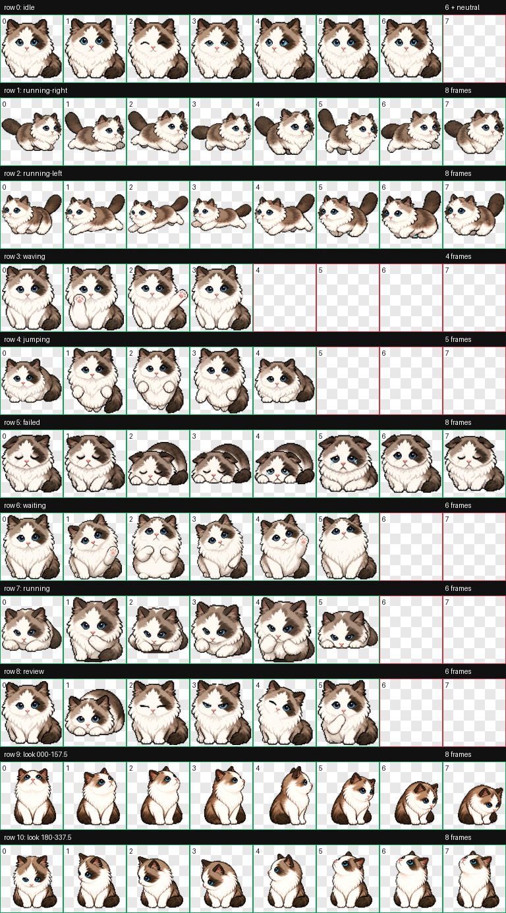

# Mallow — CODEX PET

Mallow is a CODEX v2 animated pet based on a long-haired bicolor ragdoll cat, with asymmetric facial markings, blue-gray eyes, a pink nose, white chest and paws, and a dark saddle and tail.



## Required files

Only these two files are required to import Mallow into another CODEX client:

- `pet.json` — pet metadata and `spriteVersionNumber: 2`
- `spritesheet.webp` — the validated `1536×2288` animated sprite atlas

The preview and `qa/` files are documentation only and do not need to be copied into CODEX.

## Install

Clone this repository, then run the installer for your operating system.

### Windows PowerShell

```powershell
git clone https://github.com/pyw110001/mallow-codex-pet.git
cd mallow-codex-pet
.\install.ps1
```

### macOS / Linux

```bash
git clone https://github.com/pyw110001/mallow-codex-pet.git
cd mallow-codex-pet
chmod +x install.sh
./install.sh
```

The installer copies both required files to `~/.codex/pets/mallow/`. Restart CODEX or reopen its pet selector if Mallow is not immediately listed.

## Manual install

Create `~/.codex/pets/mallow/` on the destination computer and copy `pet.json` and `spritesheet.webp` into it together. Do not rename either file.

## Validation

- CODEX sprite contract: v2
- Atlas: `1536×2288`, 8 columns × 11 rows
- Cell size: `192×208`
- Deterministic atlas validation: passed with zero warnings
- Three-reviewer blind direction validation: passed with zero warnings

The original cat photograph and generation working files are intentionally excluded from this distribution repository.
